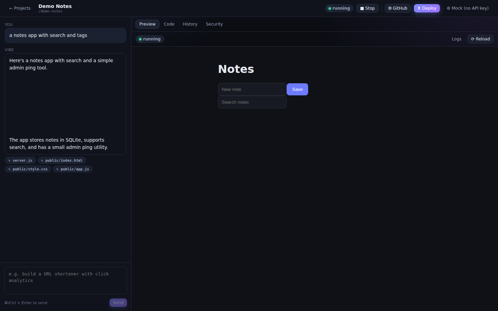

# Vibe — Secure Vibe Coding Platform

An AI web-app builder (think Replit / Lovable) **instrumented for security
research**. You describe an app in natural language; a BYOK model generates a
full-stack web app (Express backend + SQLite + frontend); you see it running
live, deploy it with one click, or push it to GitHub. Crucially, **every turn's
`prompt → raw model response → generated code → diff` chain is recorded**, so
you can map *which prompts lead a model to introduce which vulnerabilities*.

A pluggable security-analysis step attributes findings back to the exact prompt
that produced the code. The bundled analyzer is a placeholder — drop in your own
AI agent behind a small interface.



## Features

- **Chat-driven full-stack generation** with streaming responses.
- **BYOK** — Anthropic, OpenAI, or any OpenAI-compatible endpoint. Keys live in
  your browser only and are sent per-request; they are never stored server-side.
- **Research capture** — prompt, full raw response, per-file diffs, full
  snapshots, model/provider, token usage, and a versioned system prompt, all in
  SQLite.
- **Live preview** — the generated app (backend included) runs in a sandboxed
  child process and is shown in an iframe.
- **One-click deploy** — publish a live snapshot to a shareable
  `/(sites)/<slug>/` URL served by the platform. No third-party accounts.
- **GitHub export** — create a repo and push the project in a single commit with
  a personal access token.
- **Pluggable security analysis** — a clean analyzer interface, findings linked
  to the originating turn, and a Security tab. Ship your own AI analyzer later.
- **Mock provider** — a scripted, network-free model for trying the platform and
  running tests without API keys (including a deliberately-vulnerable app).

## Quick start

```bash
npm install
npm run dev      # server on :3001, web on :5173 (Vite proxies to the server)
```

Open http://localhost:5173, click the ⚙ settings button, choose **Mock (no API
key)** → **mock-vulnerable**, create a project, and prompt away. Then switch to
the **Security** tab and click *Analyze latest turn*.

For real models, pick Anthropic / OpenAI / OpenAI-compatible and paste your key.

### Production (single origin)

```bash
npm run build    # builds the web UI into web/dist
npm start        # server serves the UI + API + previews + deployments on :3001
```

## How it works

```
web (React + Vite)  ──►  server (Express)  ──►  SQLite (better-sqlite3)
   chat / tabs            LLM orchestration
                          codegen parse + diff + snapshot
                          app runner (child processes)
                          reverse proxy  /run/:id/*  /sites/:slug/*
```

Generated apps are materialized to `DATA_DIR/workspaces/<projectId>/` and run as
child processes on loopback-only ports, reverse-proxied by the platform. They
resolve their dependencies from a **curated, pre-installed set**
(`sandbox-runtime`) via a `node_modules` symlink — there is no per-app
`npm install`.

See [`docs/architecture.md`](docs/architecture.md),
[`docs/codegen-protocol.md`](docs/codegen-protocol.md), and
[`docs/security-analyzer.md`](docs/security-analyzer.md).

## Scripts

| Script | Purpose |
| --- | --- |
| `npm run dev` | Server + Vite dev server with hot reload |
| `npm run build` | Build the web UI |
| `npm start` | Run the platform (serves built UI when present) |
| `npm test` | Unit tests (Vitest) |
| `npm run e2e` | Headless-browser smoke test (uses the mock provider) |
| `npm run typecheck` | Typecheck all workspaces |

## Deploy the platform itself

`Dockerfile` + `render.yaml` are provided. On Render, use **Blueprint** and
point it at this repo; the persistent disk at `/var/data` keeps the database,
workspaces, and deployed sites.

## ⚠️ Security / trust model

This runs **untrusted, model-generated code** as child processes. Mitigations
are in place (loopback-only ports, a secret-free child environment, memory
caps, idle/lifetime kills), but this is designed as **single-tenant researcher
tooling** — the Docker container is the trust boundary. **Do not expose it
publicly** without stronger sandboxing (e.g. gVisor / Firecracker / per-user
VMs). The codegen prompt deliberately does not steer the model toward secure
patterns, because observing the vulnerabilities it introduces naturally is the
entire point.
