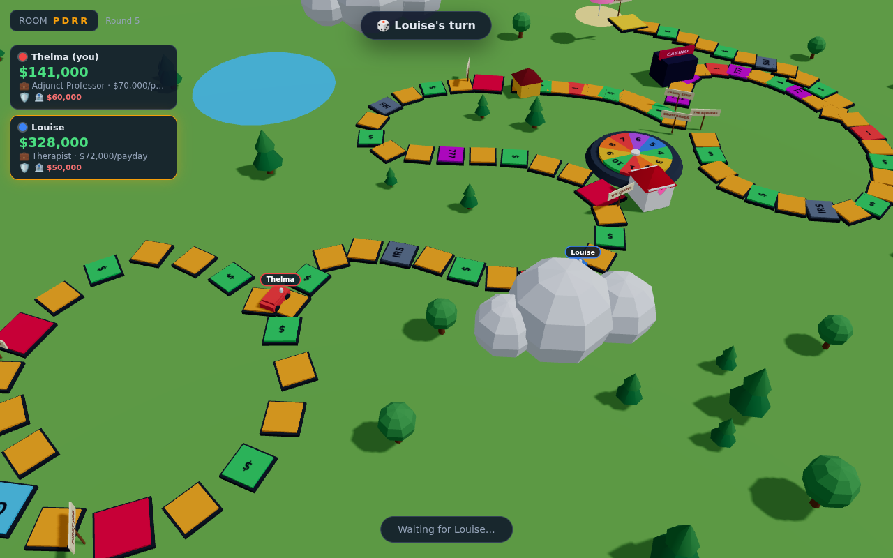

# 🚗 Midlife Crisis — The Game of Adult Life

An online multiplayer (2–6 players) 3D board game: The Game of Life, except it's the version
nobody warned you about. Marriage, divorce, DUIs, crypto rug pulls, getting cancelled, student
loans that outlive you, and a casino shortcut you absolutely should not take.

Console-game presentation in the browser: a winding 3D board, low-poly cars that gain peg
people as you marry and reproduce, a giant clickable spinner, confetti at the chapel, and a
camera that chases whoever is currently ruining their life.



## How it plays

- **Rooms**: the host creates a room and gets a 4-letter code; friends join from their own
  browsers. No accounts.
- **Turns**: spin 1–10, your car hops along the board, and the space you land on happens to you.
- **The board** (~95 spaces): two forks — *College* (debt, fancy careers) vs *Straight to Work*,
  and later *The Vegas Strip* (gamble-heavy shortcut) vs *The Suburbs* (long and safe).
  Space types: paydays, event cards, IRS, casino, car crashes, and forced stops (career pick,
  the chapel, open house day, retirement).
- **The economy**: careers with per-payday salaries, $20k loans that cost $25k at retirement,
  houses from a *Van Down by the River* to a *McMansion*, weddings that tax the whole table
  $1k in gifts, divorces that halve your cash.
- **The deck**: 115+ R-rated adult life events across relationships, vices, money, the
  internet, current events, career, and health. Some cards are choices; choose poorly.
- **Winning**: everyone eventually retires. Highest net worth wins. The kids chip in for the
  nursing home ($10k each). That's the whole scoreboard, just like real life.

Disconnected players don't stall the game — after a short grace their turns auto-resolve
(auto-spin, cautious defaults) until they rejoin; sessions resume from `localStorage`.

## Running it

```bash
npm install
npm run dev        # server :3001 + Vite client :5173 (open two browsers to test)
```

Production (single server serves everything):

```bash
npm run build
npm start          # http://localhost:3001
```

## Development

```bash
npm test           # engine unit tests (movement, forks, economy, full-game simulations)
npm run typecheck  # all three workspaces
npm run e2e        # two-headless-player smoke test (expects `npm run dev` running;
                   # set CHROMIUM_PATH if Chromium isn't at /opt/pw-browsers/chromium)
```

## Architecture

TypeScript monorepo (npm workspaces):

| Package | What it is |
| --- | --- |
| `shared/` | The whole game: board graph + 3D path coords, careers, houses, the event deck, and a pure reducer engine (`applyAction(state, playerId, action, rng) → {state, events}`) |
| `server/` | Node + Socket.IO. Authoritative: validates every action, runs the engine with a per-room seeded RNG, broadcasts snapshots plus ordered animation events, handles reconnects and auto-resolution |
| `client/` | Vite + React + react-three-fiber. Renders the board from shared data, replays the server's event list as animations (spinner, tile hops, card reveals, confetti, crash shake), then applies the snapshot |

The server never trusts the client; the client never computes rules. The deck order is
stripped from snapshots so you can't read your future, no matter how hard you doomscroll.
